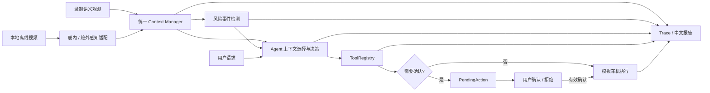

<div align="center">

# 🚗 VehicleMind

### 舱内外感知与车机 Agent 协同原型

**离线视频感知 · 统一语义上下文 · 风险事件 · Agent 工具编排 · 用户确认 · 可复现展示**

<a href="#demo">查看演示</a> · <a href="#architecture">理解架构</a> · <a href="#evidence">核对结果</a>

<br/>


<br/>

[项目简介](#overview) · [演示效果](#demo) · [核心能力](#capabilities) ·
[系统架构](#architecture) · [技术栈](#stack) · [结果与证据](#evidence) ·
[快速开始](#quickstart) · [面试讲述卡](docs/interview_story.md) · [项目结构](#structure) · [当前限制](#limitations)

</div>

---

<a id="overview"></a>
## ✨ 项目简介

**一个具体场景：**驾驶员出现疲劳驾驶迹象，舱内状态与舱外道路观测进入统一上下文；风险事件触发提醒。用户提出休息需求后，Agent 搜索服务区，但只有经过用户确认，才会启动**模拟导航**。[查看可复现场景](assets/scenarios/drowsy_rest_stop.yaml) · [看演示画面](#demo) · [核对结果与边界](#evidence)。这条业务链路展示的是感知结果如何参与 Agent 决策和受控车机动作，不是真实车辆控制。

**两条输入路径、同一套下游协同：**真实视频感知使用本地离线视频和模型权重生成观测，适合展示舱内外算法；录制语义观测回放（下称录制观测）直接读取场景内的观测，不运行感知模型，适合无密钥复现“统一上下文 → 风险事件 → Agent 决策 → 用户确认 → 模拟车机动作”。两条路径汇入同一语义上下文，见[系统架构](#architecture)。回放截图不能作为感知精度证据。

<a id="demo"></a>
## 🎬 演示效果

### 一条完整的感知到动作链路

录制的驾驶员疲劳与道路观测 → 高风险事件 → 用户请求服务区 → Agent 搜索 → 用户确认 → **模拟导航启动**。以下截图由仓库内[离线场景](assets/scenarios/drowsy_rest_stop.yaml)基于提交 `96192de` 生成。上方媒体停在较早视频画面（仍显示 NORMAL），下方统一上下文是场景末尾的 DROWSY / HIGH 与导航 ACTIVE；不要把两处当作同一时刻的推理结果。

<p align="center">
  <a href="assets/demo/vehiclemind_report_full.png"></a>
</p>

点击截图可查看[完整报告画面](assets/demo/vehiclemind_report_full.png)，其中保留了风险事件、待确认动作、显式确认、工具结果和 9 项场景断言。原始运行产物位于本地 `runs/`，不会随 GitHub 仓库发布。

截图来自录制语义观测回放；下方 GIF 来自独立的真实视频感知演示。它们不是同一次模型推理，请勿混作端到端感知准确率证明。

<p align="center">
  
  
</p>

<a id="capabilities"></a>
## 🌟 核心能力

| 能力 | 项目中的实现与可见结果 |
|---|---|
| **舱内状态感知** | 面部关键点、眼口状态、PERCLOS、哈欠等时序证据形成驾驶员状态；见[算法说明](docs/cabin_perception.md)与上方 GIF |
| **舱外道路感知** | 目标、车道和可行驶区域转为结构化观测；支持 YOLOPv2 多任务路径与可选传统车道路径，见[算法说明](docs/road_perception.md) |
| **统一上下文** | Driver / Road / Vehicle 语义状态集中管理，区分未知、无效和过期观测 |
| **事件与 Agent 编排** | 高风险变化触发事件；Agent 结合用户请求和上下文选择回复或车机工具 |
| **受控车机动作** | 搜索、空调、媒体和模拟导航等工具由注册表执行；导航进入待确认状态后才可执行，见[确认设计](docs/agent_pending_actions.md) |
| **可复现结果** | 离线回放保存配置快照、语义 trace、断言和中文 HTML 报告；在线 Agent 使用 40 条 AI 自审内部基准、80 条开发回归变体和逐 trial 语义审查 |

<a id="architecture"></a>
## 🧠 系统架构



真实视频路径调用本地感知模型；录制观测路径跳过推理，只验证下游协同。两者共用语义上下文与工具边界，但**不能用录制观测回放估计感知准确率**。Agent 可接 Qwen / GLM 在线 API；无网络的演示使用确定性离线 Agent，以保证复现。

<a id="stack"></a>
## 🛠️ 技术栈与个人工作

| 业务模块 | 输入 → 输出 / 业务作用 | 技术与项目内工作 | 可核查实现 |
|---|---|---|---|
| **舱内感知** | 离线驾驶员视频 → 面部特征、时序疲劳证据和驾驶员风险；为提醒提供状态依据 | OpenCV 处理视频帧、第三方 MediaPipe 提取关键点；项目内实现眼口与头姿特征、PERCLOS/哈欠累计和状态判定，不宣称自研关键点模型 | [感知服务](modules/cabin/perception_service.py) · [算法说明](docs/cabin_perception.md) |
| **舱外感知** | 离线道路视频 → 目标、车道、可行驶区；为道路上下文提供观测 | 第三方预训练 YOLOPv2 经 ONNX Runtime 推理，CoreML 可用时优先、CPU 回退；项目内实现预处理、后处理及结构化输出，另有 OpenCV 传统车道路径，不宣称自研模型训练 | [道路感知服务](modules/driving/perception_service.py) · [算法说明](docs/road_perception.md) |
| **统一上下文与事件** | 舱内外语义观测 + 车辆状态 → Driver/Road/Vehicle 上下文与风险事件；隔离低层帧和决策层 | 项目内实现[舱内适配](modules/vehicle_ai/integration/cabin_adapter.py)、[舱外适配](modules/vehicle_ai/integration/driving_adapter.py)、字段契约、质量/过期状态及事件去抖 | [上下文管理](modules/vehicle_ai/context/context_manager.py) · [事件检测](modules/vehicle_ai/events/event_detector.py) |
| **Agent 编排** | 用户请求 + 相关上下文/事件 → 回复或工具请求；决定何时读取车机状态与建议动作 | Qwen/GLM 是第三方在线 API；项目内实现上下文选择、对话与工具调用编排，也支持确定性离线脚本客户端 | [Agent](modules/vehicle_ai/agent/vehicle_agent.py) · [模型适配](modules/vehicle_ai/llm/factory.py) |
| **工具确认门** | 工具请求 + 用户确认 → 模拟车机状态变化；阻止未授权导航 | 项目内实现 ToolRegistry、PendingAction 与一次性确认边界；执行层校验独立于 LLM 提示词 | [工具注册表](modules/vehicle_ai/tools/registry.py) · [确认设计](docs/agent_pending_actions.md) |
| **回放与验证** | YAML 场景 → 语义 trace、自动断言和中文 HTML 报告；复现成功/失败链路 | 项目内实现确定性回放、配置快照、报告；pytest、Ruff、mypy 与 GitHub Actions 承担工程检查 | [回放运行器](modules/vehicle_ai/replay/runner.py) · [报告生成](modules/vehicle_ai/replay/report.py) · [CI](.github/workflows/ci.yml) |

项目内贡献的重点是把第三方感知与模型能力接入统一语义上下文，再用 Agent 编排、执行层确认门和可复现回放组成可解释的业务链路；**不把预训练权重、通用库能力或模拟车辆动作包装成自研算法与真实车控**。

面试时可从[面试讲述卡](docs/interview_story.md)快速查看业务场景、架构取舍、一次真实问题修复、可信数字和边界。

<a id="evidence"></a>
## 📊 结果与证据

| 已有证据 | 当前能证明什么 | 边界 |
|---|---|---|
| [成功链路：确认导航](assets/scenarios/drowsy_rest_stop.yaml) | 运行回放后，风险事件 → 搜索服务区 → 待确认 → 用户确认 → 模拟导航 `ACTIVE`；**9/9 断言通过** | 确定性录制观测与模拟车机，不是感知精度或在线模型成功率 |
| [取消链路：导航不启动](assets/scenarios/drowsy_rest_stop_cancel.yaml) | 同一业务前提下，用户对待确认动作说“取消”；**7/7 断言通过**，导航保持 `IDLE`，没有执行 `start_navigation` | 这是受控拒绝案例，不是系统故障；两个场景的未确认敏感动作执行均为 0 次 |
| [在线 Agent 失败案例：R03](scenarios/agent_eval/golden/cases/R03.yaml) | 道路观测为 `LIGHT` 且仅 2 辆车，Qwen 把它表述成“轻度拥堵”；3 次重复均经证据复查判失败 | 反映语义归因问题；在线输出非确定性，详见[失败记录](docs/reports/2026-09-24-online-agent-internal-evaluation.md)，不能保证重跑得到同一句话 |
| [双模型候选 pilot](docs/reports/2026-09-23-online-agent-pilot.md) | Qwen 与 GLM 均通过真实工具调用预检，并各完成 8 条候选 trial；保存请求与工具轨迹 | **候选 pilot**，回答语义仍需人工复核，不计算正式成功率 |
| [M01 确认流程复测](docs/reports/2026-09-23-agent-pilot-followup-review.md) | 修复前后单例显示重复导航请求与误导回复得到纠正；确认前不执行模拟导航 | 每模型仅一次修复后采样，不能推断稳定成功率 |
| [40 条内部基准双模型重复评测](docs/reports/2026-09-24-online-agent-internal-evaluation.md) | 40 条冻结场景 × 各 3 次：Qwen **82/120**、GLM **85/120** 端到端成功；分层、波动、token、延迟和失败案例均可查 | Codex AI 自审场景 + 在线 AI 辅助语义审核及证据纠错；**非独立人工标注，不是感知精度** |
| [道路感知本机性能实测](docs/reports/2026-09-24-road-performance.md) | Apple M5、1280×720、YOLOPv2 ONNX：各 3 个独立进程 × 30 测量帧；CPU **8.87–8.89 FPS**，CoreML 优先 **27.24–27.48 FPS**；推理与完整帧 p50/p95、环境和哈希见报告 | 同一离线短视频、无绘制/编码；CoreML session 含 CPU 回退；**非感知精度或上车实时保证** |

复现取消链路：把快速开始命令中的场景改为 `assets/scenarios/drowsy_rest_stop_cancel.yaml`，并使用新的 `VM_RUN_ID`；报告、`summary.json` 和 `trace.json` 会显示待确认、取消回复及未执行导航。上述两条回放都使用**合成语义观测**和**模拟车机**，不能证明真实视频感知准确率。

Agent 数字的分母是 **40 条冻结场景、每条重复 3 次、每模型 120 trial**；80 条开发回归变体不计入这些结果。场景由 Codex **AI 自审**，回答由**在线 AI 辅助**逐 trial 审核并对明确误判作证据纠错，不是独立人工金标。详细口径、失败案例和修正记录见[中文内部评测报告](docs/reports/2026-09-24-online-agent-internal-evaluation.md)。原始在线轨迹与道路性能逐帧结果保存在本地被 Git 忽略的 `runs/` 中，仓库公开场景、运行入口和审查记录，而非那次运行的全部原始请求；**尚无独立人工冻结的 Golden Set 或舱内外小样本精度**，不会借用其他项目的结果填入本页。

<a id="quickstart"></a>
## 🚀 快速开始

### 无密钥运行完整离线 Demo

需要 Python 3.13 与 [uv](https://docs.astral.sh/uv/)。在仓库根目录执行：

```bash
uv sync --group dev
VM_RUN_ID="drowsy-rest-stop-$(date +%Y%m%d-%H%M%S)-$RANDOM"
uv run --group dev python -m apps.vehicle_ai_demo.replay_demo \
  --scenario assets/scenarios/drowsy_rest_stop.yaml \
  --output-root runs --run-id "$VM_RUN_ID"
open "runs/$VM_RUN_ID/report.html"
```

这是录制语义观测回放；依赖安装完成后，**运行阶段不需要**摄像头、模型权重、API Key 或网络。输出包括 `report.html`、`summary.json`、`trace.json`、`resolved_config.yaml` 和 `run_card.md`。旧报告不会自动更新，上述命令会创建新的结果目录且不会覆盖旧运行；若工作树有改动，调试时可加 `--allow-dirty`，但 dirty 运行不适合作为正式证据。

**运行后应看到：**终端打印“通过: drowsy-rest-stop”；中文报告中的舱内/舱外面板来自录制观测，最终驾驶员状态为 `DROWSY`、风险为 `HIGH`，时间线依次包含风险事件、搜索服务区、模拟导航的待确认状态、用户确认与工具执行结果。示例场景应有 **9/9 断言通过、未确认敏感动作执行 0 次**。可打开 `summary.json` 核对 `passed`、`assertions` 与 `unauthorized_sensitive_executions`；这些是回放流程断言，不是感知精度。

**常见问题：**若提示运行目录已存在，请换新的 `VM_RUN_ID`，不要覆盖旧证据；若提示工作树不干净，先提交改动，或仅在调试时加 `--allow-dirty`；若 `open` 不可用（非 macOS），请用本机浏览器打开输出的 `report.html` 路径。安装依赖需要网络，但安装后的离线回放不调用在线模型。

### 真实视频与在线 Agent

- 可选的真实视频协同演示需自备本地视频与模型权重，命令和运行限制见[视频运行指南](docs/offline_video_pipeline.md)；它与上面的录制观测回放报告不是同一次运行。
- 对无标注本地视频，可独立生成**感知自动核验报告**，查看处理覆盖、舱内状态输出、舱外目标/车道输出与失败原因；这不计算准确率，也不触发 Agent 决策：

```bash
uv sync --extra perception --group dev
uv run --extra perception --group dev python -m scripts.audit_perception_videos \
  --cabin-dir data/perception/cabin \
  --road-dir data/perception/road
# 终端会打印新建的 runs/perception_audit/<运行ID>/report.html 路径
```

  每侧最多 50 条视频，按文件名排序冻结；正式运行逐帧推理，可能需要较长时间。模型路径为 `models/mediapipe/face_landmarker.task` 和 `models/driving/YOLOPv2_512.onnx`。`manifest.json` 记录哈希、依赖、配置及 Git 状态，`videos/` 保留本地逐视频结构化结果；旧运行不会覆盖，只有完整写入后才出现 `.complete`。来源与许可未知时保持 `unknown`；没有对齐真值标签时精度为 `not_evaluated`，输出变化不能称为误报或漏报。`runs/` 与本地视频均被 Git 忽略，请勿公开原视频或逐视频记录。macOS 上 MediaPipe 初始化可能需要可用的图形上下文；若进程在初始化时直接退出，请在本机终端运行。
- 可选的在线 Agent 决策可先复制[配置示例](.env.example)为本地 `.env`，填写 `DASHSCOPE_API_KEY` 或 `GLM_API_KEY` 与对应模型配置，然后运行下面的一条候选场景。**API 调用会产生费用**；将 `--provider qwen` 改为 `--provider glm` 可切换提供方。命令会在 `runs/agent_eval/` 生成 `report.md` 和 `trial.json`，这是在线 Agent 的单例调试，不等于上面的无密钥 HTML 演示，也不计正式成功率。不要把 `.env` 或 `runs/` 上传到 Git。

```bash
uv run --group dev python -m modules.vehicle_ai.evaluation.cli \
  scenarios/agent_eval/candidates/T02.yaml --provider qwen
```

40 条冻结内部场景的重复运行、AI 辅助审核与纠错命令见[评估说明](scenarios/agent_eval/README.md)。
- 回归检查：

```bash
uv run --group dev python -m pytest -q
uv run --group dev ruff check apps modules scripts tests
uv run --group dev python scripts/check_source_size.py
```

<a id="structure"></a>
## 📁 项目结构

```text
VehicleMind/
├── apps/                  # 舱内、舱外与协同演示入口
├── modules/cabin/         # 驾驶员状态证据与感知服务
├── modules/driving/       # 道路目标、车道、可行驶区
├── modules/vehicle_ai/    # 上下文、事件、Agent、工具与评测
├── assets/demo/           # 首页演示素材
├── assets/scenarios/      # 可复现离线场景
├── scenarios/agent_eval/  # 候选场景、冻结内部基准和开发回归变体
├── docs/                  # 算法、设计、证据与限制
└── tests/                 # 单元、集成与回归测试
```

## 💡 关键设计决策

<details><summary><b>为什么先使用离线视频与录制观测？</b></summary>

真实采集条件目前不可用。离线视频保留感知演示，录制观测则把 Agent 编排和安全确认变成无需模型权重即可复现的场景；两种证据在界面与报告中明确分开。

</details>

<details><summary><b>为什么导航需要独立确认？</b></summary>

LLM 只提出工具请求，敏感动作由确定性执行层保存为 PendingAction。用户确认后只执行保存的原始工具与规范参数；拒绝、目标变化和过期确认不能复用旧动作。参见[设计说明](docs/agent_pending_actions.md)。

</details>

<a id="limitations"></a>
## ⚠️ 当前限制与 Roadmap

- 模型权重和视频不随仓库发布；现有 GIF 是感知演示素材，不等于本次回放重新推理的输出。
- 在线双模型已有 AI 自审内部重复评测，但尚无独立人工审定的可靠性指标；舱内外小样本验证也未完成。
- 车辆状态与工具执行均为本地模拟，未连接真实车载硬件。更多边界见[项目证据与限制](docs/project_limits.md)。
- 近期优先级：完善作品集主案例与可核验结果，再补少量必要量化证据；大规模候选场景扩充暂不作为展示主线。进度见[todolist.md](todolist.md)。

原创代码采用 [Apache License 2.0](LICENSE)。预训练模型、视频、数据与第三方代码遵循各自条款，详见[第三方声明](THIRD_PARTY_NOTICES.md)。

<div align="center">

**VehicleMind · 让感知结果进入可解释、可确认、可复现的 Agent 决策链路。**

</div>
