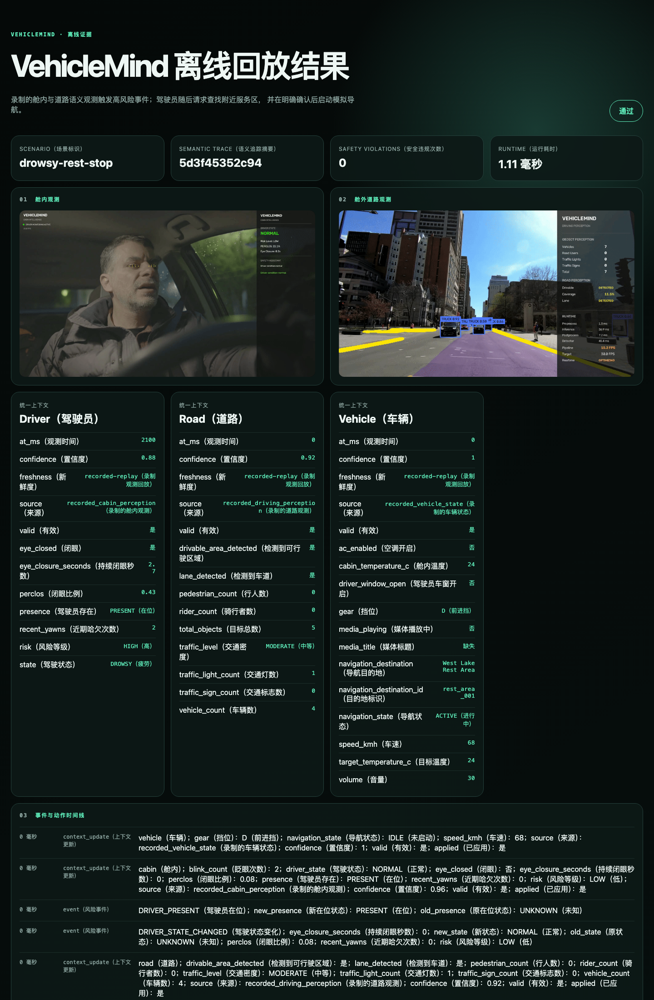
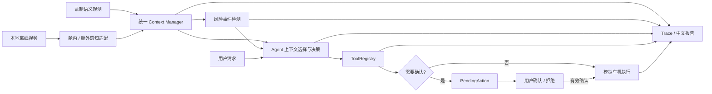

<div align="center">

# 🚗 VehicleMind

### 舱内外感知与车机 Agent 协同原型

**离线视频感知 · 统一语义上下文 · 风险事件 · Agent 工具编排 · 用户确认 · 可复现展示**

<br/>


<br/>

[项目简介](#overview) · [演示效果](#demo) · [核心能力](#capabilities) ·
[系统架构](#architecture) · [技术栈](#stack) · [结果与证据](#evidence) ·
[快速开始](#quickstart) · [项目结构](#structure) · [当前限制](#limitations)

</div>

---

<a id="overview"></a>
## ✨ 项目简介

**VehicleMind** 探索“感知信息如何进入 Agent 决策并形成可控的车机动作”：舱内驾驶员状态与舱外道路观测汇入统一上下文，风险事件与用户请求共同影响 Agent；搜索服务区后，模拟导航必须经过用户确认。项目面向**感知算法与 Agent 开发岗位**，重点展示多模块协同、状态管理、工具编排和结果可解释性。

项目提供两条必须区分的路径：<strong>真实视频感知（离线视频输入）</strong> 需要本地视频与模型权重；<strong>录制语义观测回放</strong> 无需权重、API Key 或网络，用来复现协同流程、确认门禁和报告。下方回放截图不能作为感知精度证据；模拟车机动作也不会控制真实车辆。

<a id="demo"></a>
## 🎬 演示效果

### 一条完整的感知到动作链路

录制的驾驶员疲劳与道路观测 → 高风险事件 → 用户请求服务区 → Agent 搜索 → 用户确认 → **模拟导航启动**。以下截图由仓库内[离线场景](assets/scenarios/drowsy_rest_stop.yaml)基于提交 `96192de` 生成。上方媒体停在较早视频画面（仍显示 NORMAL），下方统一上下文是场景末尾的 DROWSY / HIGH 与导航 ACTIVE；不要把两处当作同一时刻的推理结果。

<p align="center">
  <a href="assets/demo/vehiclemind_report_full.png"></a>
</p>

点击截图可查看[完整报告画面](assets/demo/vehiclemind_report_full.png)，其中保留了风险事件、待确认动作、显式确认、工具结果和 9 项场景断言。原始运行产物位于本地 `runs/`，不会随 GitHub 仓库发布。

已有的两段**感知演示素材**直接展示在首页。它们与上方录制观测回放不是同一次模型推理，请勿混作端到端感知准确率证明。

<p align="center">
  
  
</p>

<a id="capabilities"></a>
## 🌟 核心能力

| 能力 | 项目中的实现与可见结果 |
|---|---|
| **舱内状态感知** | 面部关键点、眼口状态、PERCLOS、哈欠等时序证据形成驾驶员状态；见[算法说明](docs/cabin_perception.md)与上方 GIF |
| **舱外道路感知** | 目标、车道和可行驶区域转为结构化观测；支持 YOLOPv2 多任务路径与可选传统车道路径，见[算法说明](docs/road_perception.md) |
| **统一上下文** | Driver / Road / Vehicle 语义状态集中管理，区分未知、无效和过期观测 |
| **事件与 Agent 编排** | 高风险变化触发事件；Agent 结合用户请求和上下文选择回复或车机工具 |
| **受控车机动作** | 搜索、空调、媒体和模拟导航等工具由注册表执行；导航进入待确认状态后才可执行，见[确认设计](docs/agent_pending_actions.md) |
| **可复现结果** | 离线回放保存配置快照、语义 trace、断言和中文 HTML 报告；在线 Agent 使用 40 条 AI 自审内部基准、80 条开发回归变体和逐 trial 语义审查 |

<a id="architecture"></a>
## 🧠 系统架构



真实视频路径调用本地感知模型；录制观测路径跳过推理，只验证下游协同。两者共用语义上下文与工具边界，但**不能用录制观测回放估计感知准确率**。Agent 可接 Qwen / GLM 在线 API；无网络的演示使用确定性离线 Agent，以保证复现。

<a id="stack"></a>
## 🛠️ 技术栈与个人工作

| 层级 | 技术与工作边界 |
|---|---|
| 感知接入 | OpenCV、MediaPipe、ONNX Runtime / CoreML 优先与 CPU 回退；项目内实现预处理、状态证据汇总、语义适配与离线视频流水线 |
| 道路模型 | YOLOPv2 等预训练模型属于第三方资产；项目内实现加载、后处理、输出契约与展示，不将模型训练成果归为自研 |
| Agent 编排 | Python、Qwen / GLM API、Context Selector、事件、工具注册表、PendingAction 和确认状态机 |
| 工程与展示 | YAML 场景、可复现回放、HTML 报告、pytest、Ruff、mypy、GitHub Actions |

个人工作重点是把感知输出、Agent 决策与受控工具连成可解释的系统，并用回放与真实 API pilot 暴露、定位和修复编排问题；不是提出新的目标检测网络或实现真实车辆控制。

<a id="evidence"></a>
## 📊 结果与证据

| 已有证据 | 当前能证明什么 | 边界 |
|---|---|---|
| [离线完整场景](assets/scenarios/drowsy_rest_stop.yaml) | 本地回放可生成报告；本次截图对应的运行中 **9/9 场景断言通过、未确认敏感动作执行 0 次** | 确定性录制观测与模拟车机，不是感知精度或在线模型成功率 |
| [双模型候选 pilot](docs/reports/2026-09-23-online-agent-pilot.md) | Qwen 与 GLM 均通过真实工具调用预检，并各完成 8 条候选 trial；保存请求与工具轨迹 | **候选 pilot**，回答语义仍需人工复核，不计算正式成功率 |
| [M01 确认流程复测](docs/reports/2026-09-23-agent-pilot-followup-review.md) | 修复前后单例显示重复导航请求与误导回复得到纠正；确认前不执行模拟导航 | 每模型仅一次修复后采样，不能推断稳定成功率 |
| [40 条内部基准双模型重复评测](docs/reports/2026-09-24-online-agent-internal-evaluation.md) | 40 条冻结场景 × 各 3 次：Qwen **82/120**、GLM **85/120** 端到端成功；分层、波动、token、延迟和失败案例均可查 | Codex AI 自审场景 + 在线 AI 辅助语义审核及证据纠错；**非独立人工标注，不是感知精度** |

详细评测边界与失败案例见上述技术报告。原始在线轨迹保存在本地被 Git 忽略的 `runs/` 中，仓库公开的是场景、运行入口和审查记录，而非那次运行的全部原始请求。现有 40 条 **Codex AI 自审内部基准**与 80 条开发回归变体，但**尚无独立人工冻结的 Golden Set 或舱内外小样本精度**；不会借用其他项目的结果填入本页。

<a id="quickstart"></a>
## 🚀 快速开始

### 无密钥运行完整离线 Demo

需要 Python 3.13 与 [uv](https://docs.astral.sh/uv/)。在仓库根目录执行：

```bash
uv sync --group dev
VM_RUN_ID="drowsy-rest-stop-$(date +%Y%m%d-%H%M%S)-$RANDOM"
uv run --group dev python -m apps.vehicle_ai_demo.replay_demo \
  --scenario assets/scenarios/drowsy_rest_stop.yaml \
  --output-root runs --run-id "$VM_RUN_ID"
open "runs/$VM_RUN_ID/report.html"
```

这是录制语义观测回放；依赖安装完成后，**运行阶段不需要**摄像头、模型权重、API Key 或网络。输出包括 `report.html`、`summary.json`、`trace.json` 和配置快照。旧报告不会自动更新，上述命令会创建新的结果目录且不会覆盖旧运行；若工作树有改动，调试时可加 `--allow-dirty`，但 dirty 运行不适合作为正式证据。

### 真实视频与在线 Agent

- 真实离线视频需要自备视频和第三方模型权重，按[视频运行指南](docs/offline_video_pipeline.md)准备并校验资产；不要求实时采集。
- Qwen / GLM 在线内部评估需要自备 API Key；40 条冻结集的重复运行、AI 辅助审核与纠错命令见[评估说明](scenarios/agent_eval/README.md)。不要把本地 `.env` 或 `runs/` 上传到 Git。
- 回归检查：

```bash
uv run --group dev python -m pytest -q
uv run --group dev ruff check apps modules scripts tests
uv run --group dev python scripts/check_source_size.py
```

<a id="structure"></a>
## 📁 项目结构

```text
VehicleMind/
├── apps/                  # 舱内、舱外与协同演示入口
├── modules/cabin/         # 驾驶员状态证据与感知服务
├── modules/driving/       # 道路目标、车道、可行驶区
├── modules/vehicle_ai/    # 上下文、事件、Agent、工具与评测
├── assets/demo/           # 首页演示素材
├── assets/scenarios/      # 可复现离线场景
├── scenarios/agent_eval/  # 候选场景、冻结内部基准和开发回归变体
├── docs/                  # 算法、设计、证据与限制
└── tests/                 # 单元、集成与回归测试
```

## 💡 关键设计决策

<details><summary><b>为什么先使用离线视频与录制观测？</b></summary>

真实采集条件目前不可用。离线视频保留感知演示，录制观测则把 Agent 编排和安全确认变成无需模型权重即可复现的场景；两种证据在界面与报告中明确分开。

</details>

<details><summary><b>为什么导航需要独立确认？</b></summary>

LLM 只提出工具请求，敏感动作由确定性执行层保存为 PendingAction。用户确认后只执行保存的原始工具与规范参数；拒绝、目标变化和过期确认不能复用旧动作。参见[设计说明](docs/agent_pending_actions.md)。

</details>

<a id="limitations"></a>
## ⚠️ 当前限制与 Roadmap

- 模型权重和视频不随仓库发布；现有 GIF 是感知演示素材，不等于本次回放重新推理的输出。
- 在线双模型结果仍是候选 pilot，尚未形成正式、人工审定的可靠性指标；舱内外小样本验证也未完成。
- 车辆状态与工具执行均为本地模拟，未连接真实车载硬件。更多边界见[项目证据与限制](docs/project_limits.md)。
- 近期优先级：完善作品集主案例与可核验结果，再补少量必要量化证据；大规模候选场景扩充暂不作为展示主线。进度见[todolist.md](todolist.md)。

原创代码采用 [Apache License 2.0](LICENSE)。预训练模型、视频、数据与第三方代码遵循各自条款，详见[第三方声明](THIRD_PARTY_NOTICES.md)。

<div align="center">

**VehicleMind · 让感知结果进入可解释、可确认、可复现的 Agent 决策链路。**

</div>
