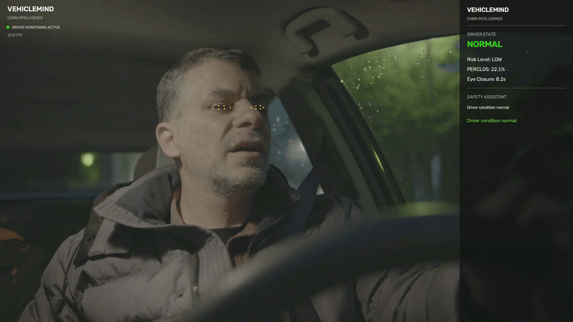

# VehicleMind

> 面向智能车辆场景的多模态 AI Demo，集成 **舱内驾驶员状态感知、舱外道路环境感知**，并逐步扩展至规划与智能人机交互。

VehicleMind 旨在构建一个 **可运行、可展示、可扩展** 的智能车辆算法系统。

当前项目已经完成两个核心感知模块：

```text
VehicleMind
    │
    ├── Cabin Intelligence
    │      ├── Driver Presence
    │      ├── Driver State
    │      ├── Fatigue Evidence
    │      └── Safety Assistant
    │
    └── Driving Perception
           ├── Object Detection
           ├── Lane Perception
           └── Drivable-area Segmentation
```

其中：

- **Cabin Intelligence** 面向驾驶员状态理解；
- **Driving Perception** 面向车辆外部道路环境理解。

> 🚧 VehicleMind 持续开发中。目前已完成 Cabin Intelligence 与 Driving Perception 两个可运行 Demo。

---

# 🎬 Demo

## Cabin Intelligence

<p align="center">
  
</p>

<p align="center">
  <b>Driver Presence → Driver State → Risk Assessment → Safety Assistant</b>
</p>

当前 Cabin Demo 使用公开驾驶员视频进行测试，通过普通 RGB 视频持续提取驾驶员视觉状态，并结合时间维度信息进行疲劳风险判断。

核心流程：

```text
Driver Video
     ↓
Face Landmark
     ↓
Driver Presence
     ↓
Eye / Mouth Observation
     ↓
Blink / PERCLOS / Eye Closure / Yawn
     ↓
Temporal Evidence
     ↓
Driver State Estimation
     ↓
NORMAL / SUSPECTED / DROWSY
     ↓
Risk Assessment
     ↓
Safety Assistant
```

当系统检测到较明显的持续闭眼、高 PERCLOS 或其他疲劳线索时，驾驶员状态可以逐步变化为：

```text
NORMAL
   ↓
SUSPECTED
   ↓
DROWSY
```

并进一步映射为：

```text
LOW
MEDIUM
HIGH
```

风险等级。

---

## Driving Perception

<p align="center">
  
</p>

<p align="center">
  <b>Road Objects + Lane Markings + Drivable Area</b>
</p>

Driving Perception 使用道路视频作为输入，通过统一多任务模型完成基础道路场景感知：

```text
Road Video
    ↓
YOLOPv2
    │
    ├── Object Detection
    ├── Lane Segmentation
    └── Drivable-area Segmentation
    ↓
Unified Driving Scene
```

当前 Demo 支持：

- 道路目标检测
- 车辆、行人和骑行者等目标感知
- 交通灯 / 交通标志等道路目标感知
- Lane Marking Segmentation
- Drivable Area Segmentation
- 统一道路场景可视化
- 视频 Demo 输出
- GIF Demo 输出

当前 macOS Apple Silicon 推理链路：

```text
Road Video
    ↓
1280 × 720 Working Frame
    ↓
Static YOLOPv2 ONNX
    ↓
512 × 512 Network Input
    ↓
CoreML Execution Provider
    ↓
Objects + Lane + Drivable Area
    ↓
Unified Visualization
```

相比早期的双模型方案，当前版本只执行一次 YOLOPv2 推理，由同一模型同时输出目标检测、车道线和可行驶区域结果，减少重复计算。

---

# 1. 项目目标

VehicleMind 并不希望成为单个：

```text
Fatigue Detection Demo
```

或者：

```text
Object Detection Demo
```

而是希望逐步构建一个具有完整感知链路的智能车辆算法系统：

```text
                     VehicleMind
                          │
          ┌───────────────┴───────────────┐
          │                               │
          ▼                               ▼
  Cabin Intelligence              Driving Perception
          │                               │
          ▼                               ▼
   Driver Understanding             Scene Understanding
          │                               │
          └───────────────┬───────────────┘
                          ▼
                    Planning / HMI
```

核心思想是：

> 让车辆不仅能够“看到”，还能够进一步理解驾驶员状态与道路环境状态，并为后续规划与驾驶辅助提供结构化信息。

---

# 2. Cabin Intelligence

当前 Cabin Intelligence 最终聚焦两个高层状态：

```text
Driver Presence
Driver State
```

底层的 EAR、PERCLOS、Blink、Yawn 等指标均作为支撑高层状态判断的视觉与时序证据。

---

## 2.1 Face Landmark

当前使用 **MediaPipe Face Landmarker** 对驾驶员面部进行关键点检测。

处理流程：

```text
RGB Frame
    ↓
Face Detection
    ↓
Face Landmark
    ↓
Eye / Mouth Geometry
```

Face Landmark 为以下模块提供基础信息：

- Eye State
- Blink Detection
- PERCLOS
- Mouth State
- Yawn Detection
- Head Pose

---

## 2.2 Driver Presence

仅检测到一帧人脸并不足以判断驾驶员是否持续存在。

因此 VehicleMind 在 Face Landmark 之上增加了 Driver Presence 状态：

```text
UNKNOWN
PRESENT
ABSENT
```

并引入短时间状态保持机制。

例如，当人脸由于：

- 快速转头
- 遮挡
- 光照变化
- 检测器短暂失效

而暂时丢失时，系统不会立即将驾驶员判断为 `ABSENT`。

整体逻辑：

```text
Face Observation
      ↓
Temporal Smoothing
      ↓
Driver Presence
```

Driver Presence 同时作为 Driver State 的有效性约束：

```text
Driver Presence != PRESENT
          ↓
Driver State = UNKNOWN
```

---

## 2.3 Eye State

基于眼部关键点计算 **Eye Aspect Ratio（EAR）**。

当前基础状态：

```text
OPEN
CLOSED
```

当前 Demo 默认 EAR 阈值：

```text
EAR threshold = 0.21
```

VehicleMind 不会直接将：

```text
EAR < threshold
```

解释为驾驶疲劳，因为正常眨眼同样会产生短时闭眼。

EAR 主要作为后续时序分析的基础观测。

---

## 2.4 Blink Detection

Blink Detector 跟踪：

```text
OPEN
 ↓
CLOSED
 ↓
OPEN
```

状态变化，从而识别完整眨眼事件。

当前支持：

- Eye State
- Blink Count
- Continuous Eye Closure
- Prolonged Eye Closure

因此系统能够区分：

```text
Normal Blink
     VS
Long Eye Closure
```

避免普通眨眼直接触发疲劳报警。

---

## 2.5 PERCLOS

VehicleMind 实现了基于时间窗口的 **PERCLOS** 估计。

基本定义为：

```text
Closed-eye Observation Time
───────────────────────────
Valid Eye Observation Time
```

相比简单统计闭眼帧比例，基于时间的计算方式可以降低：

- 视频 FPS 波动
- 推理速度变化
- 部分无效观测

对统计结果的影响。

当前 Demo 使用：

```text
Sliding Window        = 30 s
Minimum Observation   = 5 s
```

对于离线视频，系统使用：

```text
Video Timestamp
```

而不是：

```text
Program Execution Time
```

作为时序依据。

因此即使不同硬件上的推理速度不同，PERCLOS 与持续闭眼时间仍然对应原始视频时间。

---

## 2.6 Mouth State & Yawn

VehicleMind 基于嘴部关键点计算 **Mouth Aspect Ratio（MAR）**。

处理流程：

```text
Mouth Landmark
      ↓
MAR
      ↓
OPEN / CLOSED
      ↓
Open Duration
      ↓
Yawn Event
```

当前支持：

- MAR
- Mouth State
- Continuous Mouth Open Duration
- Yawn Detection
- Yawn Count

Yawn Evidence 作为 Driver State 的辅助时序线索之一，与 PERCLOS 和持续闭眼共同参与驾驶员状态判断。

---

## 2.7 Driver State

当前 Driver State 使用多种时序信息：

```text
Driver Presence
       +
PERCLOS
       +
Continuous Eye Closure
       +
Recent Yawns
       ↓
Driver State Estimator
```

输出：

| Driver State | Description |
|---|---|
| `UNKNOWN` | 当前没有可靠驾驶员状态 |
| `WARMING_UP` | 正在积累时序观测 |
| `NORMAL` | 当前未检测到明显疲劳风险 |
| `SUSPECTED` | 出现潜在疲劳迹象 |
| `DROWSY` | 检测到较明显疲劳风险 |

对应风险等级：

```text
UNKNOWN
LOW
MEDIUM
HIGH
```

当前 Demo 使用的部分工程参数：

```text
suspected_perclos           = 0.25
drowsy_perclos              = 0.30

suspected_closure_seconds   = 1.2 s
drowsy_closure_seconds      = 2.0 s

yawn_window                 = 60 s
```

这些参数用于当前 Demo 的工程验证，并不代表医学诊断标准或量产 DMS 参数。

---

# 3. Safety Assistant

VehicleMind 希望驾驶员监测能够形成：

```text
Perception
    ↓
State Understanding
    ↓
Risk Assessment
    ↓
Driver Assistance
```

而不是只停留在：

```text
Driver State = DROWSY
```

当系统检测到较高疲劳风险时，Demo 会进一步显示：

- Driver State
- Risk Level
- PERCLOS
- Continuous Eye Closure
- Recent Yawns
- Fatigue Warning
- Rest Recommendation

当前休息区相关信息，例如：

```text
Nearby Rest Area
Distance
ETA
NAVIGATE
```

仍然属于 Mock Demo 数据，用于验证：

```text
Perception
→ Risk
→ Assistance
```

的完整交互链路。

---

# 4. Driving Perception

Driving Perception 面向车辆外部道路环境。

当前重点不是追求某一个单独任务上的复杂 SOTA 模型，而是构建一个完整、统一、可运行的基础道路感知链路。

---

## 4.1 Unified Multi-task Perception

当前采用 **YOLOPv2** 完成统一多任务道路感知：

```text
                         YOLOPv2
                            │
             ┌──────────────┼──────────────┐
             │              │              │
             ▼              ▼              ▼
          Objects          Lane       Drivable Area
             │              │              │
             └──────────────┴──────────────┘
                            │
                            ▼
                     Driving Scene
```

同一模型同时完成：

```text
Object Detection
+
Lane Segmentation
+
Drivable-area Segmentation
```

避免为不同任务分别运行多个大型网络。

---

## 4.2 Object Detection

Driving Perception 可以从道路场景中检测多类交通参与者和道路目标。

输出统一结构：

```text
class
confidence
bounding box
```

最终由：

```text
DrivingObject
```

统一表示。

所有目标进一步聚合到：

```text
DrivingSceneResult
```

中。

---

## 4.3 Lane Perception

项目早期实现过基于：

```text
Color Threshold
+
Canny
+
ROI
+
Hough Transform
```

的传统 Lane Detection Baseline。

该方法在复杂道路中容易将：

- 路缘
- 阴影
- 道路纹理
- 非车道线结构

误识别为车道线。

因此当前最终 Demo 使用 YOLOPv2 的 Lane Segmentation 输出。

传统 Hough 方法保留作为 Baseline，不作为最终 Driving Perception 主流程。

---

## 4.4 Drivable Area

YOLOPv2 同时输出道路可行驶区域：

```text
Road Image
    ↓
Drivable-area Segmentation
    ↓
Binary Road Mask
```

最终可视化中使用半透明区域覆盖：

```text
Drivable Area
```

与 Lane 和 Object Detection 一起形成完整道路环境展示。

---

# 5. 实时推理优化

Driving Perception 最初采用：

```text
YOLO11
   +
YOLOPv2
```

分别负责：

```text
Object Detection
+
Lane / Drivable Area
```

这种结构存在重复推理。

因此当前版本收敛为：

```text
YOLOPv2 Only
```

一次推理同时获得：

```text
Objects
Lane
Drivable Area
```

---

## 5.1 Static ONNX

原始 YOLOPv2 ONNX 输入为动态 Shape：

```text
[1, 3, height, width]
```

为了改善 CoreML 推理效率，当前生成固定尺寸模型：

```text
[1, 3, 512, 512]
```

生成方式：

```bash
python -m onnxruntime.tools.make_dynamic_shape_fixed \
  --input_name input_image \
  --input_shape 1,3,512,512 \
  models/driving/YOLOPv2.onnx \
  models/driving/YOLOPv2_512.onnx
```

---

## 5.2 CoreML Execution Provider

在 macOS Apple Silicon 环境下，YOLOPv2 通过：

```text
ONNX Runtime
     ↓
CoreML Execution Provider
     ↓
Apple CPU / GPU / Neural Engine
```

进行硬件加速。

同时保留：

```text
CPUExecutionProvider
```

作为 fallback。

---

## 5.3 Working Resolution

原始道路视频分辨率较高：

```text
2562 × 1440
```

但完整感知后处理没有必要始终在原始分辨率进行。

当前 Pipeline 使用：

```text
2562 × 1440 Source
        ↓
1280 × 720 Working Frame
        ↓
512 × 512 Network Input
        ↓
YOLOPv2
        ↓
1280 × 720 Visualization
```

降低：

- Mask Resize
- Mask Blend
- Lane Visualization
- Dashboard Rendering
- Video Encoding

带来的额外计算量。

---

# 6. 系统架构

## 6.1 Cabin Intelligence

```text
                         RGB Video
                             │
                             ▼
                  Face Landmark Detector
                             │
             ┌───────────────┴───────────────┐
             │                               │
             ▼                               ▼
       Driver Presence               Facial Observation
                                             │
                                ┌────────────┴────────────┐
                                │                         │
                                ▼                         ▼
                           Eye Analysis              Mouth Analysis
                                │                         │
                          EAR / Closure                  MAR
                                │                         │
                       Blink / PERCLOS                  Yawn
                                │                         │
                                └────────────┬────────────┘
                                             │
                                             ▼
                                   Temporal Evidence
                                             │
                                             ▼
                                  Driver State Estimator
                                             │
                             ┌───────────────┼───────────────┐
                             ▼               ▼               ▼
                           NORMAL        SUSPECTED         DROWSY
                                             │
                                             ▼
                                      Risk Assessment
                                             │
                                             ▼
                                      Safety Assistant
```

---

## 6.2 Driving Perception

```text
                         Road Video
                             │
                             ▼
                        Resize / Input
                             │
                             ▼
                           YOLOPv2
                             │
              ┌──────────────┼──────────────┐
              │              │              │
              ▼              ▼              ▼
           Objects          Lane       Drivable Area
              │              │              │
              └──────────────┴──────────────┘
                             │
                             ▼
                       Driving Scene
                             │
                             ▼
                   Video / GIF Visualization
```

---

## 6.3 VehicleMind Overall

```text
                         VehicleMind
                             │
              ┌──────────────┴──────────────┐
              │                             │
              ▼                             ▼
       Cabin Intelligence            Driving Perception
              │                             │
        Driver Presence                   Objects
        Driver State                      Lane
        Fatigue Evidence             Drivable Area
        Safety Assistant                  │
              │                           │
              └─────────────┬─────────────┘
                            ▼
                     Scene Understanding
                            │
                     ┌──────┴──────┐
                     ▼             ▼
                  Planning   Intelligent HMI
```

---

# 7. 项目结构

```text
VehicleMind/
│
├── apps/
│   │
│   ├── cabin_demo/
│   │   ├── main.py
│   │   └── demo_video.py
│   │
│   └── driving_demo/
│       ├── object_demo.py
│       ├── lane_demo.py
│       ├── check_panoptic.py
│       └── scene_demo.py
│
├── modules/
│   │
│   ├── cabin/
│   │   │
│   │   ├── face/
│   │   │   └── landmarks.py
│   │   │
│   │   ├── fatigue/
│   │   │   ├── eye_state.py
│   │   │   ├── blink.py
│   │   │   ├── perclos.py
│   │   │   ├── mouth_state.py
│   │   │   └── yawn.py
│   │   │
│   │   ├── presence/
│   │   │   └── driver_presence.py
│   │   │
│   │   ├── head_pose/
│   │   │   └── estimator.py
│   │   │
│   │   ├── state/
│   │   │   └── driver_state.py
│   │   │
│   │   ├── assistance/
│   │   │   └── rest_advisor.py
│   │   │
│   │   └── common/
│   │       └── visualizer.py
│   │
│   └── driving/
│       │
│       ├── detection/
│       │   └── object_detector.py
│       │
│       ├── lane/
│       │   └── lane_detector.py
│       │
│       └── perception/
│           ├── __init__.py
│           ├── panoptic_detector.py
│           └── yolopv2_utils.py
│
├── models/
│   │
│   ├── mediapipe/
│   │   └── face_landmarker.task
│   │
│   └── driving/
│       ├── YOLOPv2.onnx
│       └── YOLOPv2_512.onnx
│
├── assets/
│   │
│   ├── demo/
│   │   ├── cabin_demo.gif
│   │   └── driving_perception.gif
│   │
│   └── driving/
│       ├── road_test.mp4
│       └── scene_result.mp4
│
├── configs/
├── tests/
├── requirements.txt
└── README.md
```

其中：

```text
modules/driving/detection/
modules/driving/lane/
```

保留早期独立检测 / Lane Baseline 实现。

当前最终 Driving Demo 使用：

```text
modules/driving/perception/panoptic_detector.py
```

作为统一道路感知入口。

---

# 8. 环境

当前主要开发环境：

```text
macOS
Apple Silicon
Python 3.13
OpenCV
NumPy
MediaPipe
ONNX Runtime
CoreML Execution Provider
FFmpeg
```

推荐使用 Conda：

```bash
conda create -n vehiclemind python=3.13 -y

conda activate vehiclemind
```

安装项目依赖：

```bash
python -m pip install -r requirements.txt
```

如果需要进行 ONNX Shape 转换：

```bash
python -m pip install onnx
```

---

# 9. MediaPipe

当前 Cabin Intelligence 在 macOS ARM 环境中测试使用：

```text
mediapipe==0.10.35
```

如果出现类似：

```text
DrishtiMetalHelper
Check failed: service_ Service is unavailable
```

建议优先检查 MediaPipe 版本以及当前 Python / macOS 环境兼容性。

---

# 10. ONNX Runtime

检查当前 ONNX Runtime Execution Provider：

```bash
python - <<'PY'
import onnxruntime as ort

print(
    ort.get_available_providers()
)
PY
```

Apple Silicon 环境下可能看到：

```text
CoreMLExecutionProvider
CPUExecutionProvider
```

当前 Driving Perception 默认优先使用：

```text
CoreMLExecutionProvider
```

并使用：

```text
CPUExecutionProvider
```

作为 fallback。

---

# 11. FFmpeg

GitHub Demo GIF 使用 FFmpeg 生成。

检查：

```bash
ffmpeg -version
```

macOS 可以通过：

```bash
brew install ffmpeg
```

安装。

---

# 12. 运行方式

## 12.1 Cabin — Real-time Camera

使用本机摄像头：

```bash
python -m apps.cabin_demo.main
```

该模式主要用于：

- Driver Presence Debug
- Eye State Debug
- Blink Debug
- PERCLOS Debug
- Mouth / Yawn Debug
- Driver State Debug
- Safety Assistant Debug

按：

```text
q
```

退出。

---

## 12.2 Cabin — Public Video Demo

将测试视频放置在：

```text
assets/demo/MicroSleep_test.mp4
```

运行：

```bash
python -m apps.cabin_demo.demo_video \
  --video assets/demo/MicroSleep_test.mp4 \
  --output-video assets/demo/MicroSleep_result.mp4 \
  --output-gif assets/demo/cabin_demo.gif \
  --gif-width 960 \
  --gif-fps 10 \
  --show
```

输出：

```text
assets/demo/MicroSleep_result.mp4
assets/demo/cabin_demo.gif
```

---

## 12.3 Driving — Scene Perception Demo

准备道路视频：

```text
assets/driving/road_test.mp4
```

运行：

```bash
python -m apps.driving_demo.scene_demo \
  --video assets/driving/road_test.mp4 \
  --output assets/driving/scene_result.mp4 \
  --panoptic-model models/driving/YOLOPv2_512.onnx \
  --show
```

Pipeline：

```text
Road Video
    ↓
1280 × 720 Working Frame
    ↓
YOLOPv2 512 × 512
    ↓
Object Detection
+
Lane Segmentation
+
Drivable Area
    ↓
Unified Visualization
    ↓
scene_result.mp4
```

---

## 12.4 Generate Driving GIF

生成 GitHub README 展示 GIF：

```bash
ffmpeg \
  -i assets/driving/scene_result.mp4 \
  -filter_complex \
  "[0:v]fps=12,scale=960:-1:flags=lanczos,split[a][b];[a]palettegen=max_colors=192[p];[b][p]paletteuse=dither=sierra2_4a" \
  -loop 0 \
  -y assets/demo/driving_perception.gif
```

如果视频较长，也可以截取其中一段：

```bash
ffmpeg \
  -ss 5 \
  -t 8 \
  -i assets/driving/scene_result.mp4 \
  -filter_complex \
  "[0:v]fps=12,scale=960:-1:flags=lanczos,split[a][b];[a]palettegen=max_colors=192[p];[b][p]paletteuse=dither=sierra2_4a" \
  -loop 0 \
  -y assets/demo/driving_perception.gif
```

---

# 13. Demo Data

## 13.1 Cabin Intelligence

Cabin Intelligence Demo 当前使用公开 **NITYMED** 驾驶员视频。

### NITYMED

**Night-Time Yawning-Microsleep-Eyeblink-driver Distraction**

官方网站：

https://datasets.esdalab.ece.uop.gr/

数据集面向：

- Driver Drowsiness Detection
- Driver State Monitoring
- Yawning Detection
- Microsleep Detection
- Sleepy Eyeblink Detection
- Driver Distraction

当前项目主要使用：

```text
MicroSleep_test.mp4
Yawning_test.mp4
```

进行算法测试与展示。

这些视频并非由 VehicleMind 项目自行采集。

仅用于：

- 算法研究
- 功能测试
- GitHub Demo
- Driver Monitoring 方法展示

---

## 13.2 NITYMED License

NITYMED 官方页面标注数据许可为：

**Creative Commons Attribution**

使用数据时应遵循其官方网站提供的许可和引用要求：

https://datasets.esdalab.ece.uop.gr/

---

## 13.3 NITYMED Citation

NITYMED 官方页面提供相关引用信息。

其中包括：

> N. Petrellis, P. Christakos, S. Zogas, P. Mousouliotis, G. Keramidas, N. Voros, and C. Antonopoulos,  
> “Challenges Towards Hardware Acceleration of the Deformable Shape Tracking Application,”  
> Proceedings of the IEEE VLSI SoC Virtual Conference, Singapore, October 4–8, 2021.

具体引用要求请以数据集官方网站为准。

---

## 13.4 Driving Demo

Driving Perception 使用公开道路驾驶视频作为演示输入。

公开视频仅用于：

- Object Detection 测试
- Lane Perception 测试
- Drivable-area Segmentation 测试
- GitHub Demo 展示

项目代码与第三方公开视频、模型权重分别遵循其原始来源对应的许可条款。

---

# 14. 当前实现进度

## Phase 1 — Cabin Intelligence

### Driver Observation

- [x] Face Detection
- [x] Facial Landmark Estimation
- [x] Eye Landmark Extraction
- [x] EAR Estimation
- [x] Eye State
- [x] Blink Detection
- [x] Continuous Eye Closure
- [x] PERCLOS
- [x] Mouth State
- [x] MAR
- [x] Yawn Detection

### High-level State

- [x] Driver Presence
- [x] Driver State
- [x] Multi-cue Fatigue Evidence
- [x] Risk Level
- [x] Temporal State Smoothing

### Driver Assistance

- [x] Fatigue Warning
- [x] Mock Rest Recommendation
- [x] Camera Demo
- [x] Public Video Demo
- [x] GIF Visualization

---

## Phase 2 — Driving Perception

### Perception

- [x] Public Road-video Inference
- [x] 2D Object Detection
- [x] Lane Perception
- [x] Drivable-area Segmentation
- [x] Multi-task Driving Perception
- [x] Unified Scene Visualization

### Runtime

- [x] YOLOPv2 ONNX Inference
- [x] Static ONNX Input
- [x] CoreML Execution Provider
- [x] CPU Fallback
- [x] 720p Working Pipeline
- [x] Runtime Timing
- [x] GitHub Driving Demo GIF

### Further Optimization

- [ ] Real-time Camera / Stream Input
- [ ] Multi-rate Perception Pipeline
- [ ] Asynchronous Capture / Inference / Rendering
- [ ] Additional Runtime Profiling

---

# 15. Roadmap

## Phase 3 — Planning

后续计划在仿真环境中进一步增加规划能力：

```text
Perception
    ↓
Scene Representation
    ↓
Planning
```

计划包括：

- [ ] CARLA Integration
- [ ] Map / Waypoint Interface
- [ ] Global Route Planning
- [ ] Local Path Planning
- [ ] Obstacle-aware Planning
- [ ] Trajectory Visualization

当前阶段不会直接进入真实车辆控制。

---

## Phase 4 — Intelligent HMI

进一步构建驾驶员状态与车辆功能之间的交互：

- [ ] Intent Recognition
- [ ] Vehicle Function Calling
- [ ] Driver-state-aware Dialogue
- [ ] Context-aware Recommendation
- [ ] Navigation Tool
- [ ] Multi-modal Vehicle Assistant

最终希望形成：

```text
Cabin Intelligence
        +
Driving Perception
        +
Planning
        +
Intelligent HMI
        ↓
    VehicleMind
```

---

# 16. 当前设计边界

VehicleMind 当前定位为：

> **智能车辆算法研究、工程实践与系统 Demo 项目。**

项目重点展示：

```text
Perception
    ↓
Temporal / Scene Understanding
    ↓
State Estimation
    ↓
Risk / Scene Representation
    ↓
Assistance
```

当前需要特别说明：

- VehicleMind 不是量产级自动驾驶系统；
- Cabin Intelligence 不是量产级 Driver Monitoring System；
- EAR / PERCLOS / Duration 等阈值属于 Demo 阶段工程参数；
- 当前参数未经车辆安全标准认证；
- 系统不提供医学诊断；
- Rest Area / ETA 当前属于 Mock 数据；
- `NAVIGATE` 当前仅作为交互入口展示；
- Driving Perception 当前主要用于通用道路场景感知展示；
- 系统尚未连接真实车辆控制器；
- 当前项目重点是算法模块与工程 Pipeline，而不是直接控制真实车辆。

---

# 17. Design Philosophy

VehicleMind 当前遵循几个基本设计原则。

### 1. High-level State over Raw Indicators

Cabin Intelligence 不直接输出：

```text
EAR = 0.18
```

作为最终结论，而是进一步建模：

```text
Visual Evidence
      ↓
Temporal Evidence
      ↓
Driver State
```

---

### 2. Unified Perception over Model Stacking

Driving Perception 不希望简单堆叠：

```text
Object Model
+
Lane Model
+
Road Model
```

而是优先构建：

```text
One Input
   ↓
Unified Perception
   ↓
Structured Scene Result
```

减少重复计算和系统复杂度。

---

### 3. Demo-oriented but Runtime-aware

项目虽然以可运行 Demo 为主要形式，但在实现过程中同步考虑：

- Inference Latency
- Preprocessing Cost
- Postprocessing Cost
- Video Resolution
- Execution Provider
- Static ONNX
- Real-time Pipeline

避免仅实现一个“能够离线跑通”的算法脚本。

---

### 4. Modular Architecture

各能力尽量保持模块化：

```text
Perception
State
Assistance
Visualization
```

方便后续替换算法而不重写整个系统。

---

# 18. Future

VehicleMind 后续希望逐步形成：

```text
                        VehicleMind
                            │
       ┌────────────────────┼────────────────────┐
       │                    │                    │
       ▼                    ▼                    ▼
Cabin Intelligence    Driving Perception      Planning
       │                    │                    │
       └────────────────────┼────────────────────┘
                            │
                            ▼
                    Intelligent HMI
                            │
                            ▼
                    Vehicle AI System
```

即：

> **从驾驶员感知和道路感知出发，逐步构建能够理解驾驶员、理解道路环境，并进一步提供规划与智能辅助能力的车辆 AI 系统。**

---

# 19. Disclaimer

VehicleMind 当前为研究、学习和工程展示项目。

所有：

- 模型
- 数据集
- 视频
- 第三方代码
- 第三方权重

均应遵循其原始来源对应的 License 与使用要求。

本项目当前实现不应直接用于真实车辆安全决策、医学诊断或未经验证的实际道路控制。