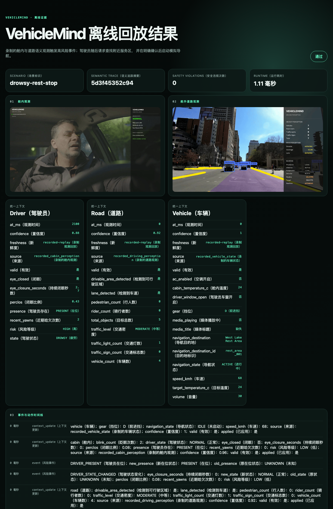
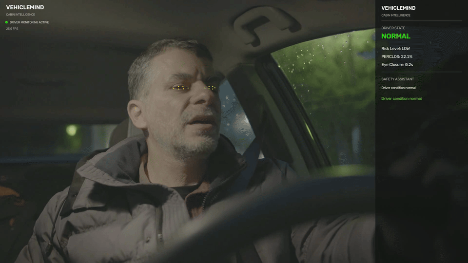
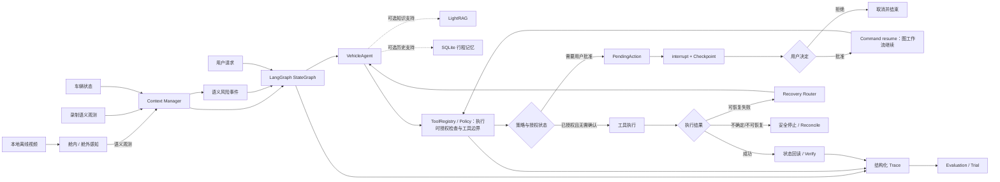

<div align="center">

# 🚗 VehicleMind：基于 LangGraph 的多模态智能座舱 Agent 系统

**离线视频感知 · LangGraph Stateful Agent · 风险事件 · Human-in-the-loop · RAG / Memory · 可复现评测**

<a href="#demo">查看演示</a> · <a href="#architecture">理解架构</a> · <a href="#evidence">核对结果</a>

<br/>


<br/>

[项目简介](#overview) · [演示效果](#demo) · [核心能力](#capabilities) ·
[系统架构](#architecture) · [技术栈](#stack) · [结果与证据](#evidence) ·
[快速开始](#quickstart) · [面试讲述卡](docs/interview_story.md) · [项目结构](#structure) · [当前限制](#limitations)

</div>

---

<a id="overview"></a>
## ✨ 项目简介

VehicleMind 将多模态感知接入一个可检查、可控的座舱 Agent 工作流。视频感知把舱内驾驶员状态与舱外道路画面转换为**语义观测**；Agent 消费这些观测、车辆状态和用户请求，形成上下文并处理风险事件、信息查询与车机动作。敏感写操作会暂停并等待用户批准；批准后工作流恢复，再由 ToolRegistry 执行授权检查与工具调用。

**两条输入路径、同一套 Agent 工作流：**真实视频路径使用本地离线视频和模型权重生成语义观测；录制语义观测回放直接读取场景中的观测，不运行感知模型，可无密钥复现下游 Agent 流程。视频感知提供观测，不代替 Agent 决策；回放截图也不能作为感知精度证据。见[系统架构](#architecture)。

<a id="demo"></a>
## 🎬 演示效果

### 疲劳风险下的休息服务区协助

舱内外感知产生疲劳与道路语义观测 → 统一上下文与事件管线汇总车辆状态并形成高风险事件，将其送入 Agent 工作流 → 用户提出休息需求 → Agent 搜索服务区 → 敏感导航写入形成 PendingAction 并暂停 → 用户批准 → 图恢复并由 ToolRegistry 执行 → 返回**模拟导航结果**。以下截图由仓库内[离线场景](assets/scenarios/drowsy_rest_stop.yaml)基于提交 `96192de` 生成。上方媒体停在较早视频画面（仍显示 NORMAL），下方统一上下文是场景末尾的 DROWSY / HIGH 与导航 ACTIVE；不要把两处当作同一时刻的推理结果。

<p align="center">
  <a href="assets/demo/vehiclemind_report_full.png"></a>
</p>

点击截图可查看[完整报告画面](assets/demo/vehiclemind_report_full.png)，其中保留了风险事件、待确认动作、显式确认、工具结果和 9 项场景断言。原始运行产物位于本地 `runs/`，不会随 GitHub 仓库发布。

截图来自录制语义观测回放；下方 GIF 来自独立的真实视频感知演示。它们不是同一次模型推理，请勿混作端到端感知准确率证明。

<p align="center">
  
  
</p>

**Agent 工程要点**

- **有状态工作流：**用户请求与语义事件进入 LangGraph `StateGraph`，checkpoint 保存可恢复状态；见 [LangGraph Runtime](modules/vehicle_ai/workflow/runtime.py) 和[设计指南](docs/guide/langgraph-stateful-agent.md)。
- **执行时授权：**敏感写操作先形成 PendingAction 并由 `interrupt()` 暂停；批准后图以 `Command(resume=...)` 继续，ToolRegistry 仍是实际工具执行与策略检查边界；见[工具注册表](modules/vehicle_ai/tools/registry.py)和[确认设计](docs/agent_pending_actions.md)。
- **有界恢复并重新确认：**失败恢复产生的新候选需要新的 PendingAction 和用户批准，不会自动重放写操作；见[计划与恢复指南](docs/guide/agent-plan-recovery.md)。
- **关联追踪与评测：**结构化 trace 关联 `thread_id` / `task_id`，记录图节点、模型/工具调用、策略、审批、恢复、状态和耗时，并可附到 trial 结果；见[Trace 实现](modules/vehicle_ai/observability/trace.py)与[评测运行器](modules/vehicle_ai/evaluation/runner.py)。

trace 默认保存在进程内，可通过可选 `TraceBackend` 导出；trace 不保存模型提示词/回复正文或工具参数值。当前默认 `InMemorySaver` 面向单座舱 Demo / 测试，不宣称跨进程或多租户持久化。

<a id="capabilities"></a>
## 🌟 核心能力

| 能力 | 项目中的实现与可见结果 |
|---|---|
| **多模态语义观测** | 舱内驾驶员状态与舱外道路画面经感知适配成为结构化观测；Agent 消费语义观测，不直接把视频帧作为工具动作 |
| **统一决策上下文** | Driver / Road / Vehicle 语义状态集中管理，区分未知、无效和过期观测，并与用户请求一起提供给 Agent；见[上下文管理](modules/vehicle_ai/context/context_manager.py) |
| **Stateful Agent 编排** | LangGraph `StateGraph` 连接请求/事件、VehicleAgent、工具策略、审批中断与恢复；见[Graph Runtime](modules/vehicle_ai/workflow/runtime.py) |
| **受控工具执行** | ToolRegistry 是策略检查和工具调用边界；敏感写操作先形成 PendingAction、暂停等待用户批准，恢复后仍须经过注册表执行；见[工具注册表](modules/vehicle_ai/tools/registry.py)与[确认设计](docs/agent_pending_actions.md) |
| **支持模块** | 可选 LightRAG 提供知识检索，SQLite 行程记忆提供只读历史事件查询；见[知识工具](modules/vehicle_ai/knowledge/tool.py)与[事件存储](modules/vehicle_ai/memory/event_store.py) |
| **追踪与评测** | 结构化 trace 关联 Agent 工作流与 trial；离线回放保留配置快照、断言和中文 HTML 报告，见[Trace](modules/vehicle_ai/observability/trace.py)与[评测运行器](modules/vehicle_ai/evaluation/runner.py) |

<a id="architecture"></a>
## 🧠 系统架构


```mermaid
flowchart LR
    V[本地离线视频] --> P[舱内 / 舱外感知]
    P -->|语义观测| C[Context Manager]
    R[录制语义观测] --> C
    VS[车辆状态] --> C
    C --> E[语义风险事件]
    C --> G[LangGraph StateGraph]
    E --> G
    U[用户请求] --> G
    G --> A[VehicleAgent]
    A -. 可选知识支持 .-> L[LightRAG]
    A -. 可选历史支持 .-> M[SQLite 行程记忆]
    A --> T[ToolRegistry / Policy：执行时授权检查与工具边界]
    T --> Q{策略与授权状态}
    Q -- 已授权且无需确认 --> X[工具执行]
    Q -- 需要用户批准 --> W[PendingAction]
    W --> I[interrupt + Checkpoint]
    I --> H{用户决定}
    H -- 拒绝 --> Z[取消并结束]
    H -- 批准 --> RS[Command resume：图工作流继续]
    RS --> T
    X --> F{执行结果}
    F -- 成功 --> K[状态回读 / Verify]
    F -- 可恢复失败 --> RC[Recovery Router]
    RC --> A
    F -- 不确定/不可恢复 --> S[安全停止 / Reconcile]
    G --> O[结构化 Trace]
    T --> O
    K --> O
    O --> EV[Evaluation / Trial]
```

真实视频路径调用本地感知模型并输出语义观测；录制观测路径跳过推理，只验证下游 Agent 协同。用户批准后，图从中断处继续，但实际工具调用仍通过 ToolRegistry 的策略检查与执行边界。两种路径共用语义上下文，但**不能用录制观测回放估计感知准确率**。Agent 可接 Qwen / GLM 在线 API；无网络的演示使用确定性离线 Agent，以保证复现。

<a id="stack"></a>
## 🛠️ 技术栈与个人工作

项目内实现围绕 Agent Runtime、执行时授权、失败恢复和关联追踪展开；感知、知识检索和行程记忆为工作流提供输入。

| Agent 主线 | 技术与项目内工作 | 实现与设计 |
|---|---|---|
| **上下文与 Runtime** | 语义观测和车辆状态汇入统一上下文；LangGraph `StateGraph` 编排用户/事件双入口，连接 Qwen / GLM API 与工具调用 | [上下文管理](modules/vehicle_ai/context/context_manager.py) · [Graph Runtime](modules/vehicle_ai/workflow/runtime.py) · [设计指南](docs/guide/langgraph-stateful-agent.md) |
| **执行时授权** | ToolRegistry 执行策略检查；敏感动作形成 PendingAction，经 `interrupt()` 等待批准，再以 `Command(resume=...)` 恢复并执行 | [工具注册表](modules/vehicle_ai/tools/registry.py) · [确认设计](docs/agent_pending_actions.md) |
| **有界计划与恢复** | 搜索、候选核验、确认、模拟导航与状态回读；最多 9 步 / 1 次恢复，替代候选需要重新确认 | [计划与恢复指南](docs/guide/agent-plan-recovery.md) |
| **结构化 Trace** | 关联 `thread_id` / `task_id`，记录图节点、模型/工具调用、策略、审批、恢复、状态和耗时；支持可选导出 backend | [Trace](modules/vehicle_ai/observability/trace.py) · [Runtime 集成](modules/vehicle_ai/observability/runtime.py) |
| **评测与回放** | YAML 场景、自动断言、配置快照和中文 HTML 报告；Agent evaluator 可将工作流 trace 附到 trial | [回放运行器](modules/vehicle_ai/replay/runner.py) · [Agent Trial](modules/vehicle_ai/evaluation/runner.py) · [在线回归指南](docs/guide/agent-regression.md) |

**支持输入：**[舱内感知](docs/cabin_perception.md)（OpenCV / MediaPipe，驾驶员状态）· [舱外感知](docs/road_perception.md)（YOLOPv2 / ONNX Runtime，道路语义）· [LightRAG](docs/guide/rag-agent-technical-details.md)（知识证据）· [SQLite 行程记忆](docs/guide/trip-memory-demo.md)（只读历史查询）。

面试讲述见[面试讲述卡](docs/interview_story.md)，包含业务场景、架构取舍与问题修复。

<a id="evidence"></a>
## 📊 结果与证据

| 代表性证据 | 结果 | 来源 |
|---|---|---|
| **确定性工作流** | 确认导航 **9/9**、取消导航 **7/7** 断言通过；两个场景的未确认敏感动作执行均为 0 次 | [确认场景](assets/scenarios/drowsy_rest_stop.yaml) · [取消场景](assets/scenarios/drowsy_rest_stop_cancel.yaml) |
| **A5 计划与恢复** | 固定场景 **7/7**；恢复 **1/1**、安全停止 **4/4**、确认合规 **7/7**、双次回放一致 **7/7**、重复写违规 **0/7** | [A5 验收报告](docs/reports/2026-09-26-a5-bounded-plan-recovery.md) · [交互结果](docs/reports/a5-bounded-plan-recovery/report.html) |
| **A6 在线回归（阶段记录）** | Qwen / GLM：Task Success **80/120 / 90/120**；Mechanical Pass **116/120 / 107/120**；Context Grounding **38/66 / 48/66**；stale/UNKNOWN Handling **4/18 / 9/18** | [A6 回归报告](docs/reports/2026-09-26-a6-online-regression.md) · [交互报告](docs/reports/a6-post-a5-regression/report.html) |
| **关联追踪** | 结构化事件将工作流、模型/工具调用与 trial 关联；现有测试覆盖关联 ID、节点与耗时等字段 | [Trace 实现](modules/vehicle_ai/observability/trace.py) · [可观测性测试](tests/vehicle_ai/test_agent_observability.py) · [评测运行器](modules/vehicle_ai/evaluation/runner.py) |

工作流与 A5 使用确定性脚本模型、合成语义观测和模拟工具。A6 使用 **40 条冻结场景 × 3 次、每模型 120 trial**，由 Qwen v4 AI 辅助语义审核；历史预算配置不完整，前后结果并列展示。最新完整重测与其他阶段记录保留在下方证据表。

**失败入口：**[R03 场景](scenarios/agent_eval/golden/cases/R03.yaml)中，道路观测为 `LIGHT` 且仅 2 辆车，Qwen 表述为“轻度拥堵”，3 次重复均经证据复查判失败。完整口径、失败与修正记录见[中文内部评测报告](docs/reports/2026-09-24-online-agent-internal-evaluation.md)；复现步骤见[在线回归自测指南](docs/guide/agent-regression.md)。

<details>
<summary><b>完整证据索引：在线评测、支持模块与失败记录</b></summary>

| 已有证据 | 结果与记录 | 评测口径 |
|---|---|---|
| [成功链路：确认导航](assets/scenarios/drowsy_rest_stop.yaml) | 运行回放后，风险事件 → 搜索服务区 → 待确认 → 用户确认 → 模拟导航 `ACTIVE`；**9/9 断言通过** | 确定性录制观测与模拟车机，核验 Agent 与工具流程 |
| [取消链路：导航不启动](assets/scenarios/drowsy_rest_stop_cancel.yaml) | 同一业务前提下，用户对待确认动作说“取消”；**7/7 断言通过**，导航保持 `IDLE`，没有执行 `start_navigation` | 受控拒绝案例；两个场景的未确认敏感动作执行均为 0 次 |
| [正常驾驶：播放音乐](assets/scenarios/normal_driver_music.yaml) | 正常/低风险上下文 → Agent 调用 `play_music` → 车辆媒体状态回读为播放中；**5/5 断言通过** | 脚本模型与模拟媒体工具，核验非导航可逆动作 |
| [在线 Agent 失败案例：R03](scenarios/agent_eval/golden/cases/R03.yaml) | 道路观测为 `LIGHT` 且仅 2 辆车，Qwen 把它表述成“轻度拥堵”；3 次重复均经证据复查判失败 | 语义归因失败；在线输出非确定性，逐次证据见[失败记录](docs/reports/2026-09-24-online-agent-internal-evaluation.md) |
| [双模型候选 pilot](docs/reports/2026-09-23-online-agent-pilot.md) | Qwen 与 GLM 均通过真实工具调用预检，并各完成 8 条候选 trial；保存请求与工具轨迹 | 候选 pilot；回答语义待人工复核 |
| [M01 确认流程复测](docs/reports/2026-09-23-agent-pilot-followup-review.md) | 修复前后单例显示重复导航请求与误导回复得到纠正；确认前不执行模拟导航 | 每模型仅一次修复后采样 |
| [LightRAG / Agent 三个主指标（最新完整重测）](docs/reports/2026-09-26-rag-agent-three-metrics.md) | Qwen / GLM：Evidence Hit@5（证据命中）均 **20/20**；Citation Support Rate（引用支持）**74/86（86.0%） / 95/104（91.3%）**；Task Success Rate（任务成功）**96/120（80.0%） / 97/120（80.8%）** | RAG 各 30 题，命中率来自独立检索探针；引用为已审子句比例，Qwen 两题审核失败；Agent 各 40 场景 × 3 次且未开启 RAG。小知识库、AI 辅助判分 |
| [A5 后在线回归（阶段记录）](docs/reports/2026-09-26-a6-online-regression.md) · [交互报告](docs/reports/a6-post-a5-regression/report.html) | 冻结 40 场景 × 3 次：Qwen **80/120**、GLM **90/120** Task Success（任务成功）；Mechanical Pass（机械通过）116/120、107/120；Context Grounding（上下文依据）38/66、48/66；stale/UNKNOWN Handling（过期/未知处理）4/18、9/18 | Qwen v4 AI 语义审核、内部合成观测和模拟工具；历史运行缺少预算配置，前后仅并列展示 |
| [Agent 决策依据与目的地变更定向回归](docs/reports/2026-09-26-agent-decision-quality.md) | C04/X08/M03 各 1 次；最终 Qwen、GLM 的 Task Success（任务成功）均为 **2/3** | 修复前两模型均为 0/3；三个合成场景 × 单次采样、AI 辅助语义审查；M03 仍保留失败/审核争议，分项见报告 |
| [历史在线基准](docs/reports/2026-09-24-online-agent-internal-evaluation.md) | 旧审核协议下 Qwen **82/120**、GLM **85/120**；v4 重审见 [A6 报告](docs/reports/2026-09-26-a6-online-regression.md) | 在线 AI 辅助语义审核，采用旧审核协议 |
| [A3 LightRAG 知识增强 Agent（阶段记录）](docs/reports/2026-09-26-a3-lightrag-evaluation.md) | 双 profile / 20 条知识源；30 题：Recall@5 **20/20**、引用支持 **69/74**、无答案审查 **5/5**、检索范围泄漏 **0**；范围修正后定向复测 **5/5** | Qwen `qwen3.8-max` 单次 AI 辅助内部评测；首轮范围弃答 **2/5**，问题与修正过程见报告 |
| [A4 行程事件记忆](docs/reports/2026-09-26-a4-trip-event-memory.md) | SQLite 跨进程保留；冻结结构化查询 **4/4**、8/8 计数/事件 ID 字段匹配；旧 HIGH 风险未注入当前车况，时间混淆检查 **0/1** | 结构化合成事件序列与确定性 Agent 检查 |
| [A5 Agent 计划与失败恢复](docs/reports/2026-09-26-a5-bounded-plan-recovery.md) · [可交互结果页](docs/reports/a5-bounded-plan-recovery/report.html) | 固定场景 **7/7**；恢复 **1/1**、安全停止 **4/4**、确认合规 **7/7**、双次回放一致 **7/7**、重复写违规 **0/7** | 确定性脚本模型、模拟地点及注入故障；未知写入场景实际回读车况后停止 |
| [Agent 提示注入确认门](docs/reports/2026-09-26-agent-prompt-injection-safety.md) | 用户越权指令、伪造确认、引用攻击和检索片段攻击 **4/4** 被执行层拦截；未确认敏感写入 **0/4** | 脚本模型主动发起攻击性工具请求，核验有限场景中的执行层确认门 |
| [道路类别映射审查](docs/reports/2026-09-26-road-class-mapping-audit.md) | ONNX Runtime 实测三份导出模型 × 三个采样帧，NMS 输出均集中在 `class_id=3`；权重 SHA 与清单一致 | 运行时复现已完成，精确训练类别语义待确定 |
| [道路感知本机性能实测](docs/reports/2026-09-24-road-performance.md) | Apple M5、1280×720、YOLOPv2 ONNX：各 3 个独立进程 × 30 测量帧；CPU **8.87–8.89 FPS**，CoreML 优先 **27.24–27.48 FPS**；推理与完整帧 p50/p95、环境和哈希见报告 | 同一离线短视频、无绘制/编码；CoreML session 含 CPU 回退 |
| [舱内外零标注自动核验](docs/reports/2026-09-24-perception-auto-audit.md) | 本机真实模型逐帧处理舱内 **26/26**、舱外 **26/26** 条视频；共 **52,872/52,872** 帧有结构化输出，运行条件与哈希可追溯 | 处理覆盖与输出分布核验；舱外目标类别全部落在 `truck`，类别映射/后处理待排查；来源许可未确认，逐视频记录不公开 |

Agent 评测分母为 **40 条冻结场景、每条重复 3 次、每模型 120 trial**；80 条开发回归变体另行记录。场景由 Codex AI 自审，回答由在线 AI 辅助逐 trial 审核，历史评测对明确误判作证据纠错；独立人工冻结的 Golden Set 和感知精度标注仍待补齐。原始在线轨迹与逐帧结果保存在本地被 Git 忽略的 `runs/`；仓库公开场景、运行入口和审查记录。

[LightRAG 三个核心指标重测](docs/reports/2026-09-26-rag-agent-three-metrics.md)分别衡量证据命中、引用支持和任务成功，保留原始审核判定与格式错误；本轮未作人工改判。分词、切块、向量化和排序见[实际技术链路](docs/guide/rag-agent-technical-details.md)。

</details>

<a id="quickstart"></a>
## 🚀 快速开始

### LangGraph Stateful Agent：无密钥审批 / 恢复演示

```bash
uv sync --group dev
uv run --group dev python -m apps.vehicle_ai_demo.langgraph_demo
```

该演示使用确定性脚本模型：Agent 请求打开驾驶员车窗后，图在敏感动作前进入 `interrupt`；调用 `resume_stateful("approve")` 后才执行原始 PendingAction。测试还覆盖“首选服务区确认后不可用 → 替代候选再次 interrupt → 第二次确认后执行”，用于验证恢复路径不会自动重放写操作。

### 无密钥运行完整离线 Demo

需要 Python 3.13 与 [uv](https://docs.astral.sh/uv/)。在仓库根目录执行：

```bash
uv sync --group dev
VM_RUN_ID="drowsy-rest-stop-$(date +%Y%m%d-%H%M%S)-$RANDOM"
uv run --group dev python -m apps.vehicle_ai_demo.replay_demo \
  --scenario assets/scenarios/drowsy_rest_stop.yaml \
  --output-root runs --run-id "$VM_RUN_ID"
open "runs/$VM_RUN_ID/report.html"
```

这是录制语义观测回放；依赖安装完成后，**运行阶段不需要**摄像头、模型权重、API Key 或网络。输出包括 `report.html`、`summary.json`、`trace.json`、`resolved_config.yaml` 和 `run_card.md`。旧报告不会自动更新，上述命令会创建新的结果目录且不会覆盖旧运行；若工作树有改动，调试时可加 `--allow-dirty`，但 dirty 运行不适合作为正式证据。

**运行后应看到：**终端打印“通过: drowsy-rest-stop”；中文报告中的舱内/舱外面板来自录制观测，最终驾驶员状态为 `DROWSY`、风险为 `HIGH`，时间线依次包含风险事件、搜索服务区、模拟导航的待确认状态、用户确认与工具执行结果。示例场景应有 **9/9 断言通过、未确认敏感动作执行 0 次**。可打开 `summary.json` 核对 `passed`、`assertions` 与 `unauthorized_sensitive_executions`；这些是回放流程断言，不是感知精度。

**常见问题：**若提示运行目录已存在，请换新的 `VM_RUN_ID`，不要覆盖旧证据；若提示工作树不干净，先提交改动，或仅在调试时加 `--allow-dirty`；若 `open` 不可用（非 macOS），请用本机浏览器打开输出的 `report.html` 路径。安装依赖需要网络，但安装后的离线回放不调用在线模型。

### 正常音乐与取消链路

另外两条主案例复用同一回放器，也各自生成中文 HTML、JSON 摘要和 trace。使用不同运行 ID，报告不会覆盖：

```bash
VM_RUN_ID="normal-driver-music-$(date +%Y%m%d-%H%M%S)-$RANDOM"
uv run --group dev python -m apps.vehicle_ai_demo.replay_demo \
  --scenario assets/scenarios/normal_driver_music.yaml \
  --output-root runs --run-id "$VM_RUN_ID"
open "runs/$VM_RUN_ID/report.html"

VM_RUN_ID="drowsy-rest-stop-cancel-$(date +%Y%m%d-%H%M%S)-$RANDOM"
uv run --group dev python -m apps.vehicle_ai_demo.replay_demo \
  --scenario assets/scenarios/drowsy_rest_stop_cancel.yaml \
  --output-root runs --run-id "$VM_RUN_ID"
open "runs/$VM_RUN_ID/report.html"
```

三条回放都使用**录制/合成语义观测**、脚本模型和模拟车机，不能证明真实视频感知准确率，也不调用在线模型。

### 可选：知识增强 Agent 在线展示

已配置 Qwen/GLM API 并构建双 profile 索引后，可运行 `.venv/bin/python scripts/run_knowledge_eval.py --mode online-rag --provider qwen --profile all`。首次安装独立 LightRAG 环境、重建索引、单题冒烟与中文报告核验步骤见[知识增强运行指南](docs/guide/knowledge-rag-demo.md)。这条路径会调用在线模型；普通离线 Demo 不会启动知识服务。

### 行程事件记忆 Agent 展示

使用在线 Qwen/GLM 启动本地离线视频协同演示后，可询问本次行程提醒次数、取消的车机操作和最近动作结果。事件保存在本机 SQLite，固定 `--trip-id` 可跨重启续读；命令与边界见[行程事件记忆演示指南](docs/guide/trip-memory-demo.md)。

### Agent 受限规划与恢复验收

不需要 API Key，运行 7 个脚本化场景，生成中文步骤报告：

```bash
uv run python scripts/run_agent_recovery_eval.py
```

报告会列出正常导航、首选失败后的新确认、无结果、取消、未知写结果、非法地点和只读重试。默认输出到 `runs/agent_recovery/<运行ID>/`；完整命令和逐场景核验方法见[运行指南](docs/guide/agent-plan-recovery.md)。

### 真实视频与在线 Agent

- 可选的真实视频协同演示需自备本地视频与模型权重，命令和运行限制见[视频运行指南](docs/offline_video_pipeline.md)；它与上面的录制观测回放报告不是同一次运行。
- 对无标注本地视频，可独立生成**感知自动核验报告**，查看处理覆盖、舱内状态输出、舱外目标/车道输出与失败原因；这不计算准确率，也不触发 Agent 决策：

```bash
uv sync --extra perception --group dev
uv run --extra perception --group dev python -m scripts.audit_perception_videos \
  --cabin-dir data/perception/cabin \
  --road-dir data/perception/road
# 终端会打印新建的 runs/perception_audit/<运行ID>/report.html 路径
```

  每侧最多 50 条视频，按文件名排序冻结；正式运行逐帧推理，可能需要较长时间。模型路径为 `models/mediapipe/face_landmarker.task` 和 `models/driving/YOLOPv2_512.onnx`。`manifest.json` 记录哈希、依赖、配置及 Git 状态，`videos/` 保留本地逐视频结构化结果；旧运行不会覆盖，只有完整写入后才出现 `.complete`。来源与许可未知时保持 `unknown`；没有对齐真值标签时精度为 `not_evaluated`，输出变化不能称为误报或漏报。`runs/` 与本地视频均被 Git 忽略，请勿公开原视频或逐视频记录。macOS 上 MediaPipe 初始化可能需要可用的图形上下文；若进程在初始化时直接退出，请在本机终端运行。

本机已完成舱内、舱外各 26 条视频的全量处理。舱内 Service Initialization Latency (服务初始化延迟) P50/P95 为 22.53/29.23 ms，First-frame Latency (首帧处理延迟) 为 8.74/9.42 ms，Steady-state Frame Latency (稳态单帧处理延迟) 为 4.38/4.86 ms；Offline Replay Throughput (离线回放吞吐) 为 204.19 FPS（26 条、30,063 帧）。这些是单次 Apple M5 本机处理结果，不是准确率或实时/端到端指标；计时口径、依赖与模型哈希见[舱内性能报告](docs/reports/2026-09-26-cabin-performance.md)。
- 可选的在线 Agent 决策可先复制[配置示例](.env.example)为本地 `.env`，填写 `DASHSCOPE_API_KEY` 或 `GLM_API_KEY` 与对应模型配置，然后运行下面的一条跨域场景。**API 调用会产生费用**；将 `--provider qwen` 改为 `--provider glm` 可切换提供方。命令会在 `runs/agent_eval/` 生成中文 `report.html`、`report.md` 和 `trial.json`；终端打印 HTML 路径，可直接用浏览器打开。HTML 按“录制舱内外观测 → 实际发送的上下文 → 在线模型回复/工具 → 模拟车机结果”展示，原始消息折叠保留；舱内外 GIF 是从仓库相对路径引用的**独立感知演示素材**，不是本次在线运行的同步画面，单独拷贝 HTML 不会带上 GIF。这是在线 Agent 的单例调试，**观测仍是录制场景、非当次视频推理**，不计正式成功率。不要把 `.env` 或 `runs/` 上传到 Git。

```bash
uv run --group dev python -m modules.vehicle_ai.evaluation.cli \
  scenarios/agent_eval/candidates/SHOWCASE01.yaml --provider qwen
```

40 条冻结内部场景的重复运行、AI 辅助审核与纠错命令见[评估说明](scenarios/agent_eval/README.md)。
- 回归检查：

```bash
uv run --group dev python -m pytest -q
uv run --group dev ruff check apps modules scripts tests
uv run --group dev python scripts/check_source_size.py
```

<a id="structure"></a>
## 📁 项目结构

```text
VehicleMind/
├── apps/                  # 舱内、舱外与协同演示入口
├── modules/cabin/         # 驾驶员状态证据与感知服务
├── modules/driving/       # 道路目标、车道、可行驶区
├── modules/vehicle_ai/    # 上下文、事件、Agent、工具与评测
├── assets/demo/           # 首页演示素材
├── assets/scenarios/      # 可复现离线场景
├── scenarios/agent_eval/  # 候选场景、冻结内部基准和开发回归变体
├── docs/                  # 算法、设计、证据与限制
└── tests/                 # 单元、集成与回归测试
```

## 💡 关键设计决策

<details><summary><b>为什么先使用离线视频与录制观测？</b></summary>

真实采集条件目前不可用。离线视频保留感知演示，录制观测则把 Agent 编排和安全确认变成无需模型权重即可复现的场景；两种证据在界面与报告中明确分开。

</details>

<details><summary><b>为什么导航需要独立确认？</b></summary>

LLM 只提出工具请求，敏感动作由确定性执行层保存为 PendingAction。用户确认后只执行保存的原始工具与规范参数；拒绝、目标变化和过期确认不能复用旧动作。参见[设计说明](docs/agent_pending_actions.md)。

</details>

<a id="limitations"></a>
## ⚠️ 当前限制与 Roadmap

- 模型权重和视频不随仓库发布；现有 GIF 是感知演示素材，不等于本次回放重新推理的输出。
- 在线双模型已有 AI 自审内部重复评测，但尚无独立人工审定的可靠性指标；舱内外小样本验证也未完成。
- 车辆状态与工具执行均为本地模拟，未连接真实车载硬件。更多边界见[项目证据与限制](docs/project_limits.md)。
- 近期优先级：完善作品集主案例与可核验结果，再补少量必要量化证据；大规模候选场景扩充暂不作为展示主线。进度见[todolist.md](todolist.md)。

原创代码采用 [Apache License 2.0](LICENSE)。预训练模型、视频、数据与第三方代码遵循各自条款，详见[第三方声明](THIRD_PARTY_NOTICES.md)。

<div align="center">

**VehicleMind · 让感知结果进入可解释、可确认、可复现的 Agent 决策链路。**

</div>
