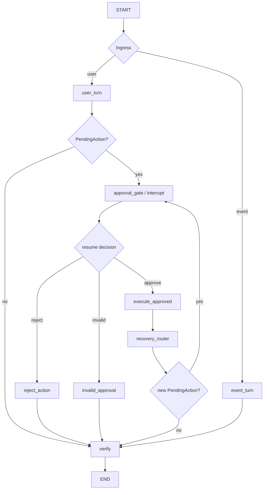

# LangGraph Stateful Agent Runtime

VehicleMind 在既有感知、上下文、ToolRegistry、PendingAction 和受限计划器之上增加 LangGraph 编排层。目标不是把原有逻辑“框架化重写”，而是把**事件入口、用户请求、人工审批、恢复分支和可检查点状态**提升为显式工作流。

## 1. 职责边界

LangGraph 负责：

- `StateGraph` 控制流和条件路由；
- `thread_id` + checkpointer 保存图状态；
- `interrupt()` 暂停敏感动作；
- `Command(resume=...)` 从审批点恢复；
- 将恢复后产生的新 PendingAction 再次送入审批门。

VehicleMind 原有模块继续负责：

- `VehicleAgent`：上下文注入、LLM/tool bounded loop；
- `TaskPlanFlow`：服务区搜索、候选核验、有限恢复；
- `ToolRegistry + AgentPolicy`：基于当前车况重新做执行策略检查；
- `PendingAction + ConfirmationIssuer`：绑定原始工具名和参数的一次性授权能力；
- `ContextManager`：Driver / Road / Vehicle 当前语义状态；
- LightRAG 与 SQLite trip memory：知识证据和历史事件。

因此 LangGraph 的 `resume` **不是权限本身**。真正写入车机状态前仍要通过 ToolRegistry 的当前策略检查和一次性确认能力。

## 2. 状态图



`VehicleWorkflowState` 只保存可序列化的业务快照：输入类型、用户文本/事件、任务快照、PendingAction、审批结果、工具结果、状态、原因与 graph trace。运行时对象（LLM client、ToolRegistry、ContextManager）不进入 checkpoint。

## 3. 为什么审批节点与执行节点分离

`interrupt()` 恢复时，包含 interrupt 的 node 会重新进入执行。因此审批节点在 `interrupt()` 之前不能执行具有副作用的车机写操作。

```text
approval_gate (pure)
  -> interrupt
  -> resume
  -> execute_approved (side effect)
```

而不是：

```text
execute_tool
  -> interrupt
```

这样恢复不会因为节点重放而重复执行原始写操作。执行层同时使用一次性 confirmation grant 防止同一个 action ID 被再次授权。

## 4. 失败恢复仍需二次确认

服务区场景中，如果用户第一次确认后发现目标不可用：

1. 首选 PendingAction 被消费；
2. `TaskPlanFlow` 只从本轮已验证候选中提出一个替代地点；
3. 创建**新的 action ID**；
4. `recovery_router` 发现新的 PendingAction；
5. 图再次进入 `approval_gate`；
6. 第二次明确确认后才执行替代导航。

恢复策略可以自动提出候选，但不能自动执行新的敏感写操作。

## 5. API

```python
result = runtime.chat_stateful("打开驾驶员车窗", debug=False)
assert result.interrupted

result = runtime.resume_stateful("approve")
assert not result.interrupted
```

语义感知事件也可以通过同一图入口：

```python
result = runtime.handle_event_stateful(vehicle_event)
```

原有 `runtime.chat()` 保留，便于已有回放/在线评测兼容；新状态图入口用于验证可检查点审批与恢复语义。

## 6. 可复现测试

```bash
uv run --group dev pytest tests/vehicle_ai/test_langgraph_workflow.py -q
uv run --group dev python -m apps.vehicle_ai_demo.langgraph_demo
```

测试覆盖普通请求、敏感动作暂停/批准/拒绝、恢复后的二次审批以及语义事件入口。

## 7. 当前边界

- 默认使用 `InMemorySaver`，适合单进程 Demo 和测试；不宣称跨进程 durable persistence。
- 一个 `VehicleAgentWorkflow` 绑定一个 `VehicleAgent` / 座舱会话。当前未实现同一 Agent 实例上的多租户并发隔离。
- 事件总线原有高风险推荐路径仍保留以兼容既有回放；`handle_event_stateful()` 提供显式 Graph 入口。后续若统一事件消费，需要先解决事件优先级、抢占和并发状态一致性。
- 工具是模拟车机能力，不是真实车辆控制。
